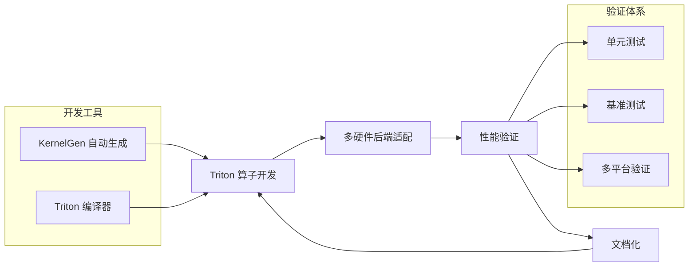

# FlagGems 仓库结构解析与使用手册

## 阅读价值

即使可以通过 IDE 直接查看官方仓库代码，本手册仍具有不可替代的价值：

| 价值维度 | 具体内容 | 实践价值 | 超越代码阅读的优势 |
|---------|----------|----------|-------------------|
| **知识体系构建** | 将分散的代码组织成系统化的知识体系，包括核心组件、依赖关系和执行流程 | 快速建立整体认知，避免碎片化理解，便于在开发和调试中快速定位问题 | 代码阅读只能获得局部理解，难以形成系统化认知 |
| **设计理念解析** | 深入阐述代码背后的设计决策和架构思想，包括权衡因素和实现原理 | 理解"为什么这么做"，而非仅知道"怎么做"，便于定制和扩展系统 | 代码只展示最终实现，不体现设计决策过程和权衡 |
| **实践经验总结** | 汇总实际使用中的常见问题和解决方案，包括安装、部署、性能优化等方面 | 避免重复踩坑，节省调试时间，快速应用成熟方案 | 官方仓库中未明确说明的实用技巧和经验 |
| **时间效率提升** | 结构化内容组织，快速定位关键部分，提供索引和导航 | 减少阅读分散代码的时间成本，提高开发和调试效率 | 代码搜索只能找到片段，难以理解整体结构和关系 |
| **可视化理解** | 提供流程图和架构图，直观展示组件关系和执行流程 | 通过图形化方式快速理解复杂系统，适合不同水平的用户 | 代码无法直接展示的宏观视角和动态流程 |
| **生态关系梳理** | 详细说明与 FlagTree、KernelGen 等生态组件的协同关系和集成方法 | 充分利用生态优势，构建完整解决方案，避免集成陷阱 | 代码中难以体现跨组件的协同机制和集成方法 |
| **边界情况分析** | 覆盖代码中未明确体现的边界情况、限制和异常处理，包括硬件兼容性和性能边界 | 提前规避潜在问题，增强系统稳定性，合理设置使用预期 | 代码通常只处理正常情况，边界处理隐藏较深 |
| **最佳实践指导** | 提供基于实际场景的最佳实践，包括配置、调优和部署策略 | 快速应用成熟方案，避免试错成本，获得最佳性能 | 官方仓库中未明确说明的实用技巧和经验 |
| **版本差异解读** | 针对特定版本的详细说明和变化分析，包括新特性、改进和兼容性问题 | 理解版本演进，选择合适版本，避免版本升级陷阱 | 代码仓库中的版本历史难以直观理解变更的影响 |
| **学习曲线优化** | 循序渐进的学习路径，从基础到高级，包含示例和实践指南 | 适合不同水平的用户快速上手，降低学习成本 | 代码阅读较为抽象，学习曲线陡峭 |

### 与官方 Wiki 的协同互补

本手册与 [FlagOS Wiki](https://wiki.flagos.io/flagos-ai/FlagGems?type=github&language=zh) 形成协同互补关系：
- **官方 Wiki**：提供基础功能介绍、标准使用方法和官方规范
- **本手册**：提供深度技术解析、实践场景分析和内部机制理解

### 读者定位

- **架构师**：理解 FlagGems 的设计理念和架构决策
- **开发者**：掌握 FlagGems 的实现细节和最佳实践
- **运维人员**：了解 FlagGems 的部署策略和性能优化
- **研究人员**：分析 FlagGems 的技术创新和生态价值

## 一、仓库结构总览

### 核心设计理念与实现

FlagGems 作为 FlagOS 生态的核心算子组件库，以三大设计理念为基础，这些理念贯穿于整个代码结构和实现中：

| 设计理念 | 核心价值 | 实现方式 | 代码体现 |
|---------|----------|----------|----------|
| **高复用性** | 大幅降低芯片厂商的算子开发与适配成本 | 标准化算子模块体系，跨后端共享内核 | `src/flag_gems/ops/` 目录下的通用算子实现 |
| **极致性能** | 充分发挥硬件性能潜力 | 针对不同硬件平台深度优化，自动调优机制 | `tune_configs.yaml` 和 LibTuner 缓存 |
| **架构通用性** | 支持多种硬件后端 | 统一架构设计，后端抽象层隔离硬件差异 | `src/flag_gems/runtime/backend/` 目录结构 |

### 整体架构链路

FlagGems 整体结构围绕核心链路组织，形成完整的开发-适配-验证-迭代闭环：

### 分层设计与职责

FlagGems 采用清晰的分层设计，每一层都有明确的职责和边界：

| 层级 | 职责 | 核心文件/目录 | 设计意图 |
|------|------|--------------|----------|
| **API 接口层** | 提供简洁的用户接口 | `src/flag_gems/__init__.py` | 降低使用门槛，提供统一入口 |
| **运行时调度层** | 选择最优实现 | `src/flag_gems/runtime/` | 根据硬件和算子类型动态调度 |
| **核心算子层** | 提供跨后端共享内核 | `src/flag_gems/ops/` | 实现高复用性，减少重复开发 |
| **硬件适配层** | 厂商专属实现 | `src/flag_gems/runtime/backend/` | 针对硬件特性优化，支持多平台 |
| **验证与工具层** | 测试与辅助工具 | `tests/`、`benchmark/`、`tools/` | 确保功能正确性和性能一致性 |

### 设计原则详解

FlagGems 的设计原则体现在代码结构和实现的各个方面：

1. **模块化**：将不同功能组件清晰分离，便于独立开发和测试
   - 示例：`ops/`、`runtime/`、`utils/` 等目录的明确划分

2. **多后端适配**：通过统一的后端抽象层，支持多种硬件平台
   - 示例：`backend/` 目录下按厂商分类的实现

3. **可测试**：建立多层次测试体系，确保功能正确性和性能一致性
   - 示例：`tests/`、`ctests/`、`modules_tests/` 等测试目录

4. **易扩展**：提供清晰的扩展点，便于添加新算子和新后端
   - 示例：统一的算子注册机制和后端抽象接口

5. **性能导向**：从 API 层到内核层的全栈性能优化
   - 示例：C++ 包装器、自动调优、LibTuner 缓存

6. **用户友好**：简洁的 API 接口和详细的文档，降低使用门槛
   - 示例：`flag_gems.enable()` 等简洁接口和完整的文档体系

### 生态定位与协同关系

FlagGems 作为 FlagOS 生态的核心算子组件库，与其他组件形成紧密的协同关系，共同构建完整的 AI 系统软件栈：

| 生态组件 | 职责 | 与 FlagGems 的协同关系 | 价值体现 |
|---------|------|-----------------------|----------|
| **FlagTree** | 统一 AI 编译器 | 为 FlagGems 提供硬件抽象和编译基础，支撑跨芯片算子编译 | 屏蔽硬件差异，提升编译稳定性，支持 KernelGen 自动生成 |
| **FlagScale** | 高效并行训推框架 | 与 FlagGems 集成提升分布式训练和推理性能 | 充分发挥集群算力，优化分布式通信 |
| **FlagCX** | 统一通信库 | 支持跨芯片分布式任务的高效通信 | 打破算力孤岛，支持异构集群协同 |
| **KernelGen** | 算子自动生成工具 | 为 FlagGems 提供自动生成的 Triton 内核 | 降低算子开发成本，提升开发效率 |

### 硬件适配情况

至2025年9月，多家芯片厂商已完成对 FlagGems 的适配与优化，覆盖主流 AI 芯片：

| 芯片厂商 | 适配情况 | 性能表现 | 特点 |
|---------|----------|----------|------|
| **寒武纪** | 支持核心算子206+ | 绝大性能达到原生算子80%+ | 深度优化，全面适配 |
| **昇腾** | 完成核心算子适配 | 性能接近原生实现 | 针对昇腾架构优化 |
| **天数智芯** | 完成主要算子适配 | 性能稳步提升 | 持续优化中 |
| **海光** | 完成基础算子适配 | 满足基本使用需求 | 逐步扩展覆盖 |
| **NVIDIA** | 完整支持 | 性能优于或接近原生实现 | 参考实现 |
| **AMD** | 完成主要算子适配 | 性能稳定 | 持续优化中 |

> 参考来源：[众智FlagOS与寒武纪硬件深度适配，打造AI产业开放协同新底座](https://blog.csdn.net/qq_41610763/article/details/154829268)

### 整体架构

FlagGems 仓库采用分层架构设计，从底层到上层依次为：

1. **硬件适配层**：各硬件厂商的专属后端实现
2. **核心算子层**：跨后端共享的 Triton 算子实现
3. **运行时调度层**：根据硬件环境和算子类型选择最优实现
4. **API 接口层**：提供简洁的用户接口
5. **验证与工具层**：测试、基准和辅助工具

## 二、根目录核心文件

根目录包含仓库的基础配置、协议说明、构建入口等核心文件，是仓库的「总控层」。这些文件定义了项目的基本规则和构建流程，为整个项目提供基础支撑。

| 文件 / 目录 | 核心作用 |
|------------|----------|
| `.clang-format` | C/C++ 代码格式化配置，统一代码风格 |
| `.pre-commit-config.yaml` | Git 预提交钩子配置，自动检查代码格式（black、isort、flake8、clang-format 等） |
| `CMakeLists.txt/cmake/` | C++ 模块构建脚本，用于编译 lib/ 下的 C++ 封装算子、后端调度逻辑等 |
| `pyproject.toml/pytest.ini` | Python 项目配置（依赖、测试框架（pytest）参数） |
| `LICENSE` | Apache 2.0 开源许可证，定义代码使用规则 |
| `README.md/README_cn.md` | 仓库核心说明（功能、特性、快速开始、贡献方式），中英文双版本 |
| `CONTRIBUTING.md/CONTRIBUTING_cn.md` | 贡献指南，规范代码提交、PR、Issue 流程 |
| `CODE_OF_CONDUCT.md/SECURITY.md` | 行为准则、安全漏洞上报规则 |
| `MAINTAINERS.md` | 维护者列表，明确核心维护人员职责 |
| `flag_tree_requirements/` | 各硬件后端（昇腾 / 天数智芯 / 海光等）的依赖清单（如 requirements_ascend.txt） |

### FQA

#### 配置与构建

- **Q: 如何快速配置开发环境？**
  **A: 首先克隆仓库，然后根据目标硬件后端安装对应的依赖（如 `pip install -r flag_tree_requirements/requirements_nvidia.txt`），最后使用 `pip install -e .` 以开发模式安装。**

- **Q: C++ 模块编译失败怎么办？**
  **A: 检查 CMake 版本（建议 3.18+）、编译器（支持 C++14+）是否满足要求，确保依赖库已安装，可参考 `cmake/` 下的配置文件排查问题。**

- **Q: 如何使用 pre-commit 钩子？**
  **A: 安装 `pre-commit` 包后，运行 `pre-commit install` 即可启用，每次 commit 时会自动执行代码格式化和检查。**

#### 依赖管理

- **Q: 不同硬件后端的依赖冲突如何解决？**
  **A: 建议使用虚拟环境或容器隔离不同后端的依赖，避免版本冲突。**

- **Q: 如何确定当前环境的依赖是否完整？**
  **A: 运行 `pip check` 检查依赖完整性，或参考对应后端的 `requirements_*.txt` 文件进行验证。**

## 三、核心源码目录：src/

`src/flag_gems/` 是仓库的核心业务层，承载算子实现、多后端适配、运行时调度等核心逻辑，也是代码量最大的目录。这部分代码直接决定了 FlagGems 的性能表现和跨平台能力。

### 1. 核心子目录拆解

| 子目录 | 核心作用 |
|--------|----------|
| `src/flag_gems/ops/` | 通用 Triton 算子实现（如 softmax、归约 / 逐点算子），跨后端共享的算子内核 |
| `src/flag_gems/runtime/` | 运行时核心逻辑，核心子目录为 backend/（多硬件后端适配层） |
| `src/flag_gems/runtime/backend/` | 各硬件厂商的专属后端适配（按 _vendorname 命名）： - `_amd/`：AMD 后端（含 tune_configs.yaml 调优配置） - `_ascend/`：昇腾后端（算子 + 调优配置） - `_arm/`：ARM 后端 - `_cambricon/`：寒武纪后端 - `_kunlunxin/`：昆仑芯后端 - `_nvidia/`：NVIDIA 后端（参考实现） 每个后端包含： ① `ops/`：厂商定制化算子（如昆仑芯 nllloss、寒武纪 stack/upsample）； ② `tune_configs.yaml`：算子调优参数（block 大小、warps 数、stages 数等） |
| `src/flag_gems/utils/` | 工具函数（如 shape_utils.py 提供 tensor 形状启发式计算、code_cache 代码缓存、code_utils 代码生成辅助） |

### 2. 关键文件示例

- `src/flag_gems/ops/softmax.py`：跨后端共享的 softmax 反向算子 Triton 内核；
- `src/flag_gems/runtime/backend/_kunlunxin/ops/nllloss.py`：昆仑芯定制化 NLLLoss 算子实现；
- `src/flag_gems/runtime/backend/_ascend/tune_configs.yaml`：昇腾后端算子调优参数（如 addmm、conv2d、sum 等算子的 block 大小配置）。

### 3. 模块实现

FlagGems 提供了一系列高性能模块，位于 `src/flag_gems/modules/` 目录，这些模块使用 FlagGems 优化的算子实现，可作为 PyTorch 标准模块的直接替代品：

| 模块 | 功能 | 文件位置 |
|------|------|----------|
| `GemsRMSNorm` | RMS 归一化 | `src/flag_gems/modules/normalization.py` |
| `GemsRope` | 旋转位置编码 | `src/flag_gems/modules/rotary.py` |
| `GemsDeepseekYarnRoPE` | DeepSeek 风格的 RoPE | `src/flag_gems/modules/rotary.py` |
| `GemsSiluAndMul` | 融合 SiLU 激活与乘法 | `src/flag_gems/modules/activation.py` |

### FQA

#### 算子开发

- **Q: 如何开发新的 Triton 算子？**
  **A: 参考 `src/flag_gems/ops/` 下的现有算子实现，遵循统一的接口规范，使用 Triton 语言编写内核，然后在相应后端目录添加适配代码。**

- **Q: 如何为特定硬件后端优化算子？**
  **A: 在对应后端的 `ops/` 目录下实现定制化算子，或通过修改 `tune_configs.yaml` 调整调优参数，针对硬件特性进行优化。**

- **Q: 如何测试新算子的正确性？**
  **A: 在 `tests/` 目录下添加单元测试，使用 `pytest` 运行测试，确保在不同后端上的结果与 PyTorch 原生实现一致。**

#### 后端适配

- **Q: 如何添加新的硬件后端？**
  **A: 在 `src/flag_gems/runtime/backend/` 下创建新的后端目录（如 `_newvendor/`），实现必要的后端接口和算子适配，并在 `flag_tree_requirements/` 下添加对应的依赖清单。**

- **Q: 后端检测失败怎么办？**
  **A: 检查硬件驱动和依赖是否正确安装，可通过设置环境变量 `GEMS_VENDOR=<vendor>` 手动指定后端。**

- **Q: 如何验证后端适配的性能？**
  **A: 使用 `benchmark/` 目录下的测试脚本，比较启用/禁用 FlagGems 时的性能差异，针对瓶颈进行优化。**

## 四、文档目录：docs/ + mkdocs.yml

`docs/` 目录包含「快速开始」「使用指南」「多后端特性」「Flaggems 使用教程」等文档，覆盖从入门到进阶的全流程。`mkdocs.yml` 是 MkDocs 文档构建配置，用于自动生成静态文档并部署到指定服务器。

### 核心文档文件

| 文档文件 | 核心内容 |
|----------|----------|
| `docs/getting-started.md` | 快速开始指南，帮助用户快速上手 FlagGems |
| `docs/usage.md` | 使用指南，详细说明 FlagGems 的使用方法和配置选项 |
| `docs/features.md` | 特性文档，介绍 FlagGems 的核心特性和技术亮点 |
| `docs/how_to_use_flaggems.md` | 使用教程，提供详细的使用示例和最佳实践 |
| `docs/installation.md` | 安装指南，说明不同环境下的安装方法 |
| `docs/operators.md` | 算子文档，列出支持的算子及其性能特性 |
| `docs/performance_and_benchmark.md` | 性能基准文档，介绍性能测试方法和结果 |

### FQA

#### 文档使用

- **Q: 如何本地构建文档？**
  **A: 安装 MkDocs 及其依赖后，运行 `mkdocs serve` 即可在本地预览文档，或使用 `mkdocs build` 构建静态文档。**

- **Q: 如何贡献文档？**
  **A: 按照 `CONTRIBUTING.md` 的规范，修改或添加文档文件，然后提交 PR，维护者会审核并合并。**

- **Q: 文档与代码不同步怎么办？**
  **A: 在提交代码变更时，同时更新相关文档，确保文档与代码保持一致，这是贡献流程的要求之一。**

## 五、基准测试目录：benchmark/

`benchmark/` 目录用于验证算子 / 模型性能，是性能优化的核心验证层。通过基准测试，可以评估 FlagGems 在不同硬件平台和不同工作负载下的性能表现，指导进一步的优化方向。

### 核心子目录

| 子目录 / 文件 | 核心作用 |
|---------------|----------|
| `benchmark/models_benchmark/` | 模型级性能基准： - `benchmark_dataset.py`：基准数据集抽象类（定义数据加载、采样逻辑）； - `offline.sh/online.sh`：离线 / 在线性能测试脚本（对比 FlagGems 开启 / 关闭后的吞吐量）； |
| `benchmark/models_shapes/` | 模型算子形状配置（如 `qwen25.yaml` 定义 Qwen25 模型的 mm/addmm/fused_add_rms_norm 等算子的输入形状） |

### FQA

#### 性能测试

- **Q: 如何运行模型级基准测试？**
  **A: 进入 `benchmark/models_benchmark/` 目录，运行 `./offline.sh <model_name>` 或 `./online.sh <model_name>`，如 `./offline.sh llama2`。**

- **Q: 如何添加新模型的基准测试？**
  **A: 在 `benchmark/models_shapes/` 下添加模型的形状配置文件，然后在 `benchmark/models_benchmark/` 中添加对应的测试逻辑。**

- **Q: 如何分析性能测试结果？**
  **A: 测试脚本会生成详细的性能报告，包括吞吐量、延迟等指标，可与 PyTorch 原生实现对比，找出性能瓶颈。**

#### 预调优

- **Q: 如何使用基准测试结果进行预调优？**
  **A: 基于基准测试中发现的热点算子和常见形状，使用 `examples/pretune.py` 进行预调优，生成调优缓存。**

- **Q: 预调优对性能有多大影响？**
  **A: 预调优可以显著减少首次执行的延迟，对于推理场景尤为重要，通常可以减少 30-50% 的启动延迟。**

## 六、测试目录：多维度验证体系

FlagGems 仓库提供多层级测试，确保算子正确性、性能一致性。这些测试覆盖了从单元测试到集成测试的各个层面，保证了代码质量和可靠性。

### 核心测试目录

| 目录 / 文件 | 核心作用 |
|-------------|----------|
| `tests/` | Python 单元测试（如 `test_general_reduction_ops.py` 验证归约算子（max）在寒武纪 / Metax 后端的精度） |
| `tests/test_DSA/` | 特定硬件（DSA）的算子精度检查（如 `test_indexer_k_tiled.py` 包含错误提示函数） |
| `ctests/` | C++ 模块测试，验证 lib/ 下 C++ 封装算子的正确性 |
| `experimental_tests/` | 实验性测试（新算子 / 新后端的验证，暂未合入主测试流程） |
| `modules_tests/` | 模块级集成测试，验证跨模块（如算子 + 后端调度）的逻辑正确性 |
| `Testing/` | 测试辅助脚本 / 配置（如测试环境初始化、数据生成） |

### FQA

#### 测试执行

- **Q: 如何运行 Python 单元测试？**
  **A: 安装测试依赖后，运行 `pytest tests/` 即可执行单元测试，可通过 `-v` 参数查看详细输出。**

- **Q: 如何运行 C++ 模块测试？**
  **A: 编译 C++ 模块后，运行 `ctest` 或直接执行编译生成的测试可执行文件。**

- **Q: 如何在特定后端上运行测试？**
  **A: 设置环境变量 `GEMS_VENDOR=<vendor>` 后运行测试，确保在目标后端上执行。**

#### 测试覆盖

- **Q: 如何确保新代码的测试覆盖？**
  **A: 为新算子或新功能添加相应的单元测试，确保测试覆盖主要使用场景和边界情况。**

- **Q: 如何处理测试失败？**
  **A: 分析测试失败的原因，修复代码中的问题，确保在所有后端上的测试都能通过。**

- **Q: 如何添加性能回归测试？**
  **A: 在 `benchmark/` 目录下添加性能测试，定期运行并比较结果，确保性能不会回归。**

## 七、辅助工具 / 扩展目录

FlagGems 仓库还包含一系列辅助工具和扩展目录，为开发、调试和部署提供支持。

### 核心辅助目录

| 目录 | 核心作用 |
|------|----------|
| `tools/` | 开发 / 调试辅助工具（如算子代码生成、性能分析、日志解析脚本） |
| `examples/` | 算子使用示例（如如何调用 FlagGems 加速 Llama-2-7b 模型推理 / 训练） |
| `triton_src/` | Triton 内核源码扩展（补充官方 Triton 未覆盖的底层逻辑） |
| `lib//include/` | C++ 层封装： - `lib/`：C++ 算子实现（如 topk）； - `include/`：C++ 头文件（定义后端调度接口） |
| `container/` | 容器化部署配置（Dockerfile / 镜像构建脚本），方便跨环境复用 |
| `.github/` | GitHub 工作流配置（CI/CD）： - 自动测试（覆盖 Hopper/Metax 等硬件）； - 自动构建文档； - 代码格式检查 |

### FQA

#### 工具使用

- **Q: 如何使用 `examples/` 目录下的示例？**
  **A: 进入 `examples/` 目录，运行示例脚本，如 `python model_llama_test.py` 测试 Llama 模型的加速效果。**

- **Q: 如何使用 C++ 扩展？**
  **A: 确保安装了 C++ 依赖，运行 `pip install -e .` 时会自动编译 C++ 扩展，可通过 `from flag_gems import c_operators` 验证是否安装成功。**

- **Q: 如何使用容器化部署？**
  **A: 参考 `container/` 目录下的 Dockerfile，构建容器镜像，然后在容器中运行 FlagGems。**

#### 开发与调试

- **Q: 如何使用 `tools/` 目录下的辅助工具？**
  **A: 参考工具的文档或帮助信息，如 `python tools/codegen.py --help` 查看代码生成工具的使用方法。**

- **Q: 如何调试 Triton 算子？**
  **A: 启用详细日志 `flag_gems.enable(record=True, path="./gems_debug.log")`，分析日志中的算子调用和性能信息。**

- **Q: 如何分析性能瓶颈？**
  **A: 使用 `torch.profiler` 或 `tools/` 下的性能分析工具，识别热点算子和瓶颈，针对性进行优化。**

## 八、总结：仓库结构的设计逻辑

FlagGems 仓库结构围绕「通用算子层 + 多后端适配层 + 验证层」三层架构设计，这种结构既降低了跨硬件开发的成本，也通过分层测试、基准保证了代码的可靠性和性能，是 FlagOS 生态中「模型 - 硬件」桥梁的核心体现。

### FlagTree：统一 AI 编译器底座

[FlagTree](https://github.com/flagos-ai/FlagTree) 是 FlagOS 生态的统一编译器项目，为 FlagGems 提供关键支撑：

- **统一硬件抽象**：屏蔽不同 AI 芯片的架构差异，包括并行模型、内存层级、指令集等
- **编译稳定性**：提升算子在多芯片环境下的编译性能与正确性
- **KernelGen 支撑**：为算子自动生成工具提供编译基础，确保跨芯片工程可行性

### KernelGen：算子开发新范式

[KernelGen](https://kernelgen.flagos.io) 是 FlagOS 生态的算子自动生成工具，将算子开发从「专家手工活」转变为可复制、可扩展的工程流程：

1. **自然语言输入**：用户通过对话框输入自然语言、数学公式或已有实现表达算子开发需求
2. **自动代码生成**：根据输入自动生成优化的 Triton 内核代码
3. **多芯片验证**：在多种硬件平台上验证生成的算子，确保正确性和性能
4. **FlagTree 协同**：由 FlagTree 提供统一的硬件抽象与编译基础

### 性能验证数据

根据公开资料，FlagGems 在多芯片平台上的性能表现：

- **寒武纪**：支持核心算子206+，绝大性能达到原生算子80%+
- **其他平台**：在 NVIDIA、AMD 等平台上也有显著的性能提升

> 参考来源：[众智FlagOS与寒武纪硬件深度适配，打造AI产业开放协同新底座](https://blog.csdn.net/qq_41610763/article/details/154829268)

### 设计优势

1. **分层清晰**：从通用算子到后端适配，每一层都有明确的职责和边界
2. **扩展性强**：模块化设计使得添加新算子和新后端变得简单直接
3. **可维护性高**：统一的代码风格和测试体系，保证代码质量
4. **性能优化**：通过调优配置和后端定制，充分发挥硬件性能
5. **用户友好**：简洁的 API 接口和详细的文档，降低使用门槛

### 使用建议

1. **开发新算子**：参考 `src/flag_gems/ops/` 下的现有实现，遵循统一的接口规范
2. **优化特定硬件**：在对应后端目录下添加定制化实现和调优配置
3. **验证性能**：使用 `benchmark/` 目录下的测试脚本，确保性能提升
4. **贡献代码**：遵循 `CONTRIBUTING.md` 的规范，提交高质量的代码和文档
5. **部署生产**：使用预调优和 C++ 扩展，获得最佳性能

### 未来展望

FlagGems 仓库结构为未来的发展预留了充足的扩展空间，可预见的发展方向包括：

1. **支持更多硬件后端**：不断扩展对新硬件平台的支持
2. **增加更多算子**：覆盖更多 PyTorch 算子，提供更全面的加速
3. **优化 C++ 扩展**：进一步提升性能，减少 Python 开销
4. **增强工具链**：提供更丰富的开发和调试工具
5. **深化与框架集成**：与更多深度学习框架无缝集成

通过这种模块化、可扩展的设计，FlagGems 有望成为 AI 领域跨硬件平台加速的标准解决方案，为不同硬件平台上的模型训练和推理提供一致、高效的体验。