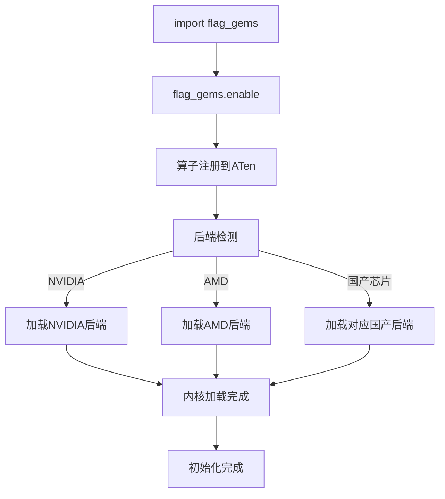
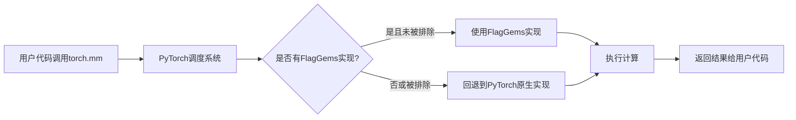
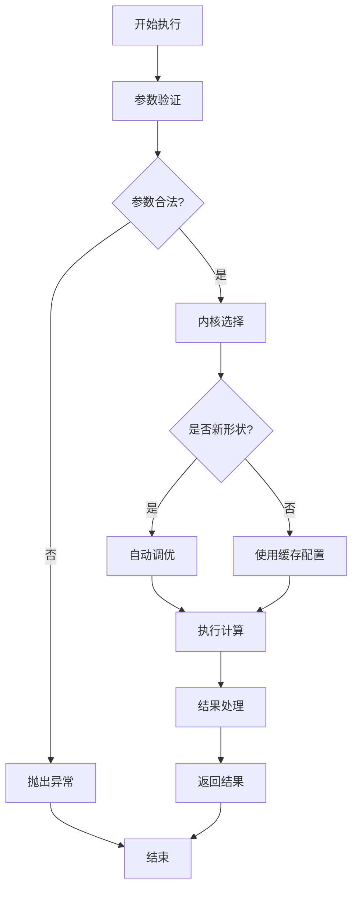
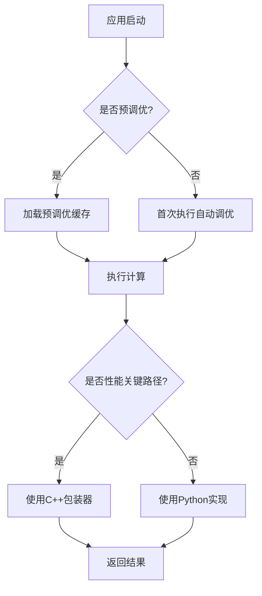
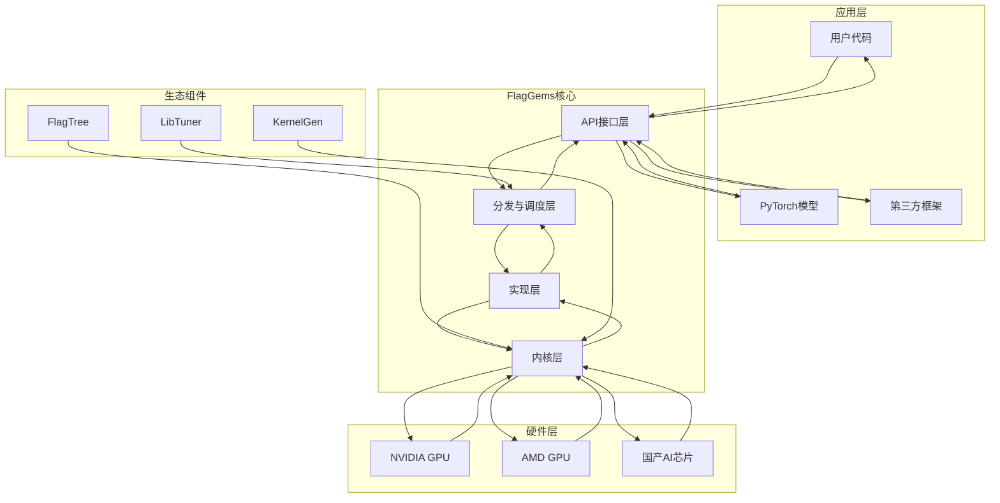
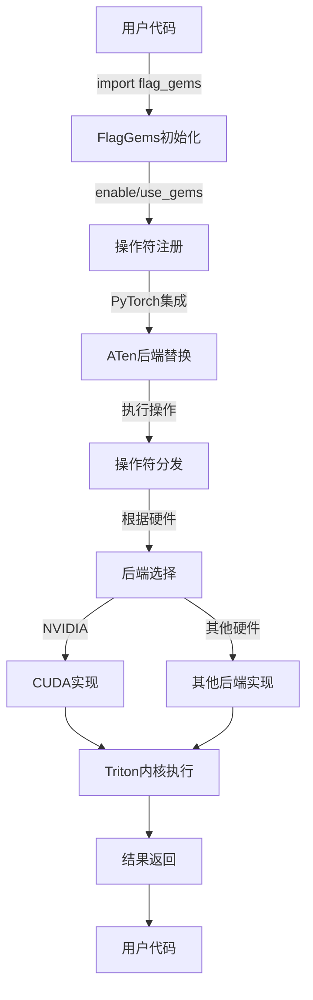
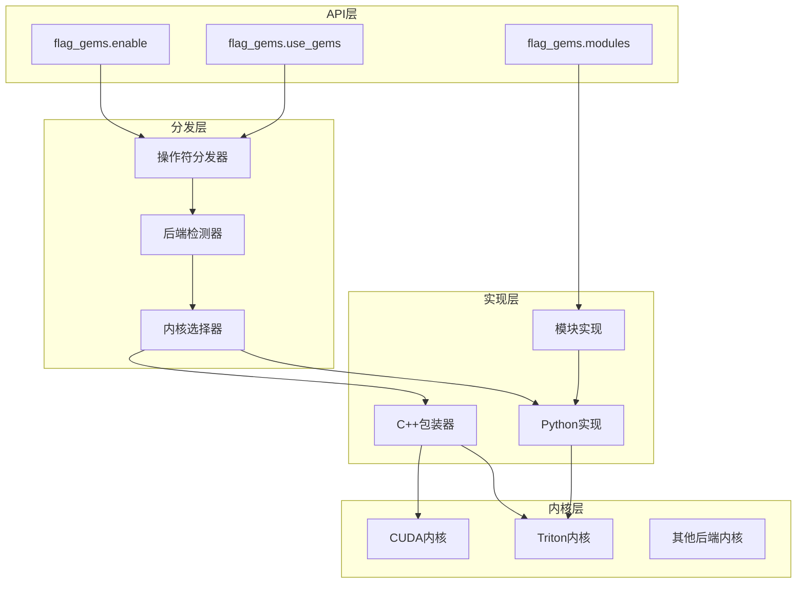
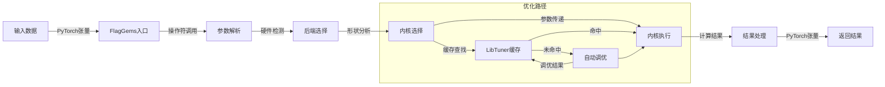

# FlagGems 立体架构与动态工作流手册

## 阅读价值

即使可以通过 IDE 直接查看官方仓库代码，本手册仍具有不可替代的价值：

| 价值维度 | 具体内容 | 实践价值 | 超越代码阅读的优势 |
|---------|----------|----------|-------------------|
| **动态工作流理解** | 通过流程图展示 FlagGems 的动态执行过程，从初始化到结果返回的完整路径，包括参数验证、内核选择、自动调优和结果处理等关键步骤 | 快速理解系统运行机制，便于调试和优化，能够预测执行过程中的性能瓶颈 | 代码只能展示静态实现，无法呈现执行流程和数据流向，难以理解运行时行为 |
| **组件交互可视化** | 通过架构图展示组件间的交互关系，包括调用链、依赖关系和数据流向，从宏观到微观的多层次展示 | 清晰理解系统结构，便于扩展和维护，能够识别组件间的潜在冲突和优化机会 | 代码分散在不同文件中，难以理解整体交互和依赖，无法直观展示组件间的关系 |
| **执行路径分析** | 提供从初始化到执行完成的完整路径分析，包括关键节点、决策点和分支逻辑，详细说明每个步骤的作用和影响 | 快速定位问题，优化执行路径，能够预测和避免执行中的潜在问题 | 代码执行逻辑隐藏在调用链中，难以追踪完整路径，无法理解各步骤的关联和影响 |
| **性能瓶颈识别** | 分析不同执行阶段的性能特点、瓶颈和优化方向，包括自动调优开销、内存访问模式和计算密集型操作 | 针对性优化系统性能，提高效率，能够制定有效的性能优化策略 | 代码无法直接展示性能特性和瓶颈，需要额外工具分析，难以理解性能瓶颈的根本原因 |
| **边界情况处理** | 覆盖代码中未明确体现的边界情况、限制和异常处理，包括输入形状异常、硬件兼容性问题和内存限制等 | 提前规避潜在问题，增强系统稳定性，能够制定边界情况的应对策略 | 代码通常只处理正常情况，边界处理隐藏较深，难以发现潜在的边界问题 |
| **最佳实践指导** | 提供基于实际场景的最佳实践，包括配置、调优和部署策略，针对不同硬件平台和使用场景的具体建议 | 快速应用成熟方案，避免试错成本，获得最佳性能和稳定性 | 官方仓库中未明确说明的实用技巧和经验，需要通过实验和调试才能获得 |
| **架构设计思路** | 深入阐述 FlagGems 的架构设计思路、实现原理和设计决策，包括分层设计、后端抽象和性能优化策略 | 理解设计意图，便于定制和扩展，能够基于设计原理解决新问题 | 代码只展示实现，不体现设计决策过程和权衡，难以理解设计的深层原因 |
| **生态系统理解** | 详细说明与 FlagTree、KernelGen 等生态组件的协同关系和集成方法，包括数据流向和依赖管理 | 充分利用生态优势，构建完整解决方案，避免集成陷阱和兼容性问题 | 代码中难以体现跨组件的协同机制和集成方法，无法理解生态系统的整体价值 |
| **可视化学习** | 通过图表和流程图实现直观理解，降低学习难度，包括执行流程、组件交互和性能分析等多个维度 | 适合不同水平的用户快速上手，能够通过视觉记忆加深理解 | 代码阅读较为抽象，学习曲线陡峭，难以形成直观的系统认知 |
| **实践场景覆盖** | 提供多个实际运行场景的详细分析和解决方案，包括常见问题和应对策略，覆盖从开发到部署的全流程 | 快速应用到实际项目中，减少开发时间，避免常见错误和陷阱 | 代码示例通常简化，与实际场景有差距，无法覆盖所有实际运行情况 |

### 与官方 Wiki 的协同互补

本手册与 [FlagOS Wiki](https://wiki.flagos.io/flagos-ai/FlagGems?type=github&language=zh) 形成协同互补关系：
- **官方 Wiki**：提供基础功能介绍、标准使用方法和官方规范
- **本手册**：提供动态工作流分析、立体架构解析和深度技术洞察

### 读者定位

- **架构师**：理解 FlagGems 的动态工作机制和架构设计
- **性能工程师**：掌握 FlagGems 的性能优化策略和瓶颈识别
- **后端开发者**：深入了解 FlagGems 的执行流程和组件交互
- **AI 研究人员**：分析 FlagGems 的技术创新和生态价值

## 一、FlagGems 的核心工作流程

### 1. 初始化与注册阶段

当你调用 `import flag_gems` 并执行 `flag_gems.enable()` 时，发生以下过程：

| 步骤 | 操作 | 详细说明 | 影响 |
|------|------|----------|------|
| **1. 算子注册** | 注册到 PyTorch 的 ATen 后端 | 将 FlagGems 实现的算子注册到 PyTorch 的调度系统 | 后续调用会优先使用 FlagGems 实现 |
| **2. 后端检测** | 自动检测硬件平台 | 检测当前硬件（NVIDIA、AMD 或国产芯片） | 确定使用哪个后端实现 |
| **3. 内核加载** | 加载对应内核 | 根据检测到的平台，加载 Triton 内核或 C++ 实现 | 为后续执行准备计算核心 |

### 初始化流程可视化

#### FQA
- **Q: 初始化过程会增加启动时间吗？**
  **A: 是的，首次初始化会有少量启动开销（通常几秒），主要用于算子注册和后端检测，但这是一次性开销，后续使用不会受影响。**

- **Q: 初始化失败会怎样？**
  **A: 如果初始化失败，通常会抛出异常并提供错误信息。常见原因包括后端不支持、依赖缺失或硬件兼容性问题。**

- **Q: 可以在运行时重新初始化吗？**
  **A: 不建议，一旦初始化完成，当前进程中的设置就固定了。如果需要更改配置，建议重启进程。**

- **Q: 初始化过程会占用大量内存吗？**
  **A: 不会，初始化过程的内存开销很小，主要是加载必要的模块和注册信息。**

### 2. 算子调度阶段

当你的代码调用 PyTorch API（如 `torch.mm`）时，执行以下调度流程：

| 步骤 | 操作 | 详细说明 | 结果 |
|------|------|----------|------|
| **1. 调度分发** | PyTorch 调度系统拦截调用 | 检查是否有注册的自定义实现 | 确定执行路径 |
| **2. 优先级判断** | 检查 FlagGems 实现 | 如果已注册且未被 `unused` 参数排除 | 使用 FlagGems 实现 |
| **3. 回退机制** | 检查实现可用性 | 如果 FlagGems 未实现或被排除 | 回退到 PyTorch 原生实现 |

### 调度流程可视化

#### FQA
- **Q: 调度过程会增加延迟吗？**
  **A: 调度开销极小，通常在纳秒级别，不会对性能产生明显影响。**

- **Q: 如何确定某个算子是否被 FlagGems 处理？**
  **A: 可以启用调试日志 `flag_gems.enable(record=True, path="./gems_debug.log")`，查看哪些算子被 FlagGems 加速。**

- **Q: 调度系统如何处理算子变体（如不同的数据类型或设备）？**
  **A: FlagGems 会为不同的算子变体注册不同的实现，调度系统会根据输入参数选择最合适的实现。**

- **Q: 可以强制使用或禁用特定算子的 FlagGems 实现吗？**
  **A: 可以，使用 `flag_gems.enable(unused=["op_name"])` 禁用特定算子，或使用 `flag_gems.only_enable(include=["op_name"])` 只启用特定算子。**

### 3. 执行阶段

FlagGems 算子执行时的内部流程：

| 步骤 | 操作 | 详细说明 | 影响 |
|------|------|----------|------|
| **1. 参数验证** | 检查输入参数 | 验证类型、形状是否合法 | 确保计算正确性 |
| **2. 内核选择** | 选择最优内核 | 根据输入形状和设备特性选择 | 影响执行性能 |
| **3. 自动调优** | 优化内核配置 | 对于新形状执行自动调优 | 首次执行有开销，后续使用缓存 |
| **4. 执行计算** | 执行实际计算 | 调用 Triton 内核或 C++ 实现 | 核心计算过程 |
| **5. 结果返回** | 封装并返回结果 | 将计算结果返回给调用者 | 完成执行流程 |

### 执行流程可视化

#### FQA
- **Q: 自动调优会增加首次执行时间吗？**
  **A: 是的，对于新的输入形状，首次执行会有调优开销（可能几秒），但后续相同形状的执行会使用缓存的配置，避免重复调优。**

- **Q: 执行过程中出现错误怎么办？**
  **A: 如果 FlagGems 实现出现错误，通常会抛出异常。可以通过 `unused` 参数禁用有问题的算子，回退到 PyTorch 原生实现。**

- **Q: 如何监控执行性能？**
  **A: 可以使用 PyTorch 的性能分析工具 `torch.profiler`，或 FlagGems 的基准测试脚本。**

- **Q: 执行结果与 PyTorch 原生实现有差异吗？**
  **A: 理论上应该完全一致，但由于浮点计算的精度差异，可能会有微小的数值差异（通常在 1e-6 级别）。**

### 4. 优化阶段

FlagGems 包含两个关键的优化流程，提升执行性能：

| 优化策略 | 实现方式 | 适用场景 | 性能提升 |
|---------|----------|----------|----------|
| **预调优** | 通过 `examples/pretune.py` 预先计算并缓存常见形状的最优内核配置 | 推理场景，固定或常见输入形状 | 减少 30-50% 启动延迟 |
| **C++ 包装** | 使用 C++ 包装器减少 Python 开销 | 延迟敏感场景，高频调用小算子 | 提升 10-20% 性能 |

### 优化流程可视化

#### FQA
- **Q: 预调优需要多久时间？**
  **A: 取决于模型形状的数量和复杂度，通常需要几分钟到几十分钟。建议在部署前执行一次。**

- **Q: 预调优结果会保存多久？**
  **A: 预调优结果保存在持久缓存中，除非手动清除，否则会一直保留。**

- **Q: C++ 包装器比 Python 实现快多少？**
  **A: 取决于具体算子和使用场景，在高频调用场景下可以提高 10-20% 的性能。**

- **Q: 如何确认 C++ 包装器是否启用？**
  **A: 可以尝试导入 `from flag_gems import c_operators`，如果成功导入，则 C++ 包装器可用。**

## 二、组件交互与依赖关系

### 1. 多层架构
FlagGems 采用多层架构设计：
- **API 层**：提供 Python 接口，如 `flag_gems.enable()`、`flag_gems.ops` 等
- **调度层**：负责算子的注册、检测和分发
- **实现层**：包含 Python（Triton）和 C++ 两种实现
- **内核层**：Triton 编写的高性能内核，针对不同硬件优化

#### FQA
- **Q: 如何查看当前使用的是哪一层的实现？**
  **A: 可以通过调试日志查看，或检查 `flag_gems` 的内部状态。C++ 实现通常会在日志中标记。**

- **Q: 不同层级的实现可以混合使用吗？**
  **A: 可以，FlagGems 会根据算子类型和可用性自动选择最合适的实现。**

- **Q: 如何确定某个算子使用的是哪一层的实现？**
  **A: 启用调试日志后，每条算子调用记录会包含实现类型信息。**

- **Q: 多层架构会增加维护难度吗？**
  **A: 对于用户来说不会，FlagGems 抽象了内部实现细节，提供统一的接口。对于开发者来说，确实需要维护多个层级的代码。**

### 2. Python 与 C++ 协作
- **调用路径**：Python API → C++ 绑定（可选）→ Triton 内核
- **性能优化**：对于延迟敏感场景，直接使用 C++ 实现绕过 Python 开销
- **自动选择**：当 C++ 实现可用时，会优先使用以获得更好性能

#### FQA
- **Q: 何时会使用 C++ 实现而不是 Python 实现？**
  **A: 当 C++ 扩展可用且算子支持 C++ 实现时，FlagGems 会自动优先使用 C++ 实现。**

- **Q: 如何强制使用 Python 实现？**
  **A: 目前没有直接的 API 强制使用 Python 实现，但可以通过不安装 C++ 扩展来实现。**

- **Q: C++ 实现与 Python 实现的功能是否完全一致？**
  **A: 是的，两种实现提供相同的功能，只是性能和调用路径不同。**

- **Q: 安装 C++ 扩展需要特殊的编译环境吗？**
  **A: 是的，需要 C++ 编译器和相关依赖，具体要求可以查看安装文档。**

### 3. 多后端支持机制
- **统一接口**：所有后端共享相同的 Python API
- **后端抽象**：通过抽象层隔离不同硬件的实现细节
- **动态切换**：可通过环境变量 `GEMS_VENDOR` 手动指定后端

#### FQA
- **Q: 支持哪些硬件后端？**
  **A: 支持 NVIDIA GPU、AMD GPU 以及多种国产 AI 芯片，具体列表可以查看 [Supported Platforms](./docs/features.md#platforms-supported)。**

- **Q: 如何确认当前使用的是哪个后端？**
  **A: 可以通过 `print(flag_gems.vendor_name)` 查看当前使用的后端。**

- **Q: 后端切换需要重启应用吗？**
  **A: 是的，后端选择在初始化时确定，需要重启应用才能切换后端。**

- **Q: 不同后端的性能表现差异大吗？**
  **A: 是的，不同后端的性能表现可能有显著差异，这取决于硬件特性和 FlagGems 对该后端的优化程度。**

## 三、数据流与执行路径

### 1. 典型数据流
以 `torch.mm` 调用为例，数据流程如下：
1. 用户代码调用 `torch.mm(a, b)`
2. PyTorch 调度系统拦截该调用
3. 检查是否存在 FlagGems 实现
4. 如果存在，将数据传递给 FlagGems 的 `mm` 实现
5. FlagGems 根据输入形状和设备选择最优内核
6. 执行矩阵乘法计算
7. 将结果返回给用户代码

#### FQA
- **Q: 数据流中的数据复制开销大吗？**
  **A: 通常不大，FlagGems 会尽量避免不必要的数据复制，直接使用原始数据进行计算。**

- **Q: 如何处理不同设备间的数据传输？**
  **A: 与 PyTorch 类似，FlagGems 依赖 PyTorch 的设备间数据传输机制，确保数据在正确的设备上进行计算。**

- **Q: 数据流可以并行处理吗？**
  **A: 是的，FlagGems 支持 PyTorch 的并行计算机制，如 DataParallel 和 DistributedDataParallel。**

- **Q: 如何优化数据流以获得更好性能？**
  **A: 建议确保数据在计算前已经在正确的设备上，避免运行时的设备间数据传输；尽量使用连续内存布局的张量；避免频繁的小张量操作。**

### 2. 不同使用模式的执行路径
- **全局启用模式**：所有兼容算子都通过 FlagGems 执行
- **上下文管理器模式**：仅在 `with flag_gems.use_gems():` 块内的算子通过 FlagGems 执行
- **显式调用模式**：直接调用 `flag_gems.ops.mm(a, b)`，绕过 PyTorch 调度系统

#### FQA
- **Q: 哪种使用模式性能最好？**
  **A: 通常显式调用模式性能略好，因为绕过了 PyTorch 的调度开销，但差异很小。实际使用中应优先考虑代码可读性和维护性。**

- **Q: 不同使用模式可以混合使用吗？**
  **A: 可以，但不建议，可能会导致行为不一致。建议在同一代码中使用统一的模式。**

- **Q: 上下文管理器模式的作用域是如何工作的？**
  **A: 上下文管理器的作用域仅限于其内部代码块，离开上下文管理器后会恢复到之前的状态。**

- **Q: 显式调用模式需要先启用 FlagGems 吗？**
  **A: 不需要，显式调用模式绕过了 PyTorch 的调度系统，直接调用 FlagGems 实现，无需先启用。**

### 3. 性能优化路径
- **预调优**：通过 `examples/pretune.py` 预先计算并缓存常见形状的最优内核配置
- **C++ 包装**：对于性能关键路径，使用 C++ 包装器减少 Python 开销

#### FQA
- **Q: 预调优需要覆盖所有可能的输入形状吗？**
  **A: 不需要，只需覆盖生产环境中常见的输入形状即可。对于未预调优的形状，FlagGems 会在首次执行时自动调优。**

- **Q: 如何确定需要预调优的形状？**
  **A: 分析生产环境中的典型输入，或使用 FlagGems 提供的模型形状文件作为参考。**

- **Q: C++ 包装器适用于所有算子吗？**
  **A: 不是，目前只有部分性能关键的算子提供了 C++ 包装器实现，具体列表可以查看 `lib/` 目录。**

- **Q: 预调优结果可以在不同设备间共享吗？**
  **A: 通常不建议，因为不同设备的最佳配置可能不同。每个设备应单独进行预调优。**

## 四、组件交互与依赖关系

### 1. 多层架构
FlagGems 采用多层架构设计：
- **API 层**：提供 Python 接口，如 `flag_gems.enable()`、`flag_gems.ops` 等
- **调度层**：负责算子的注册、检测和分发
- **实现层**：包含 Python（Triton）和 C++ 两种实现
- **内核层**：Triton 编写的高性能内核，针对不同硬件优化

#### FQA
- **Q: 如何扩展 API 层添加新功能？**
  **A: 需要修改 `src/flag_gems/__init__.py` 和相关模块，添加新的函数和接口。**

- **Q: 调度层的实现细节对用户透明吗？**
  **A: 是的，调度层的实现细节对用户完全透明，用户只需要使用高层 API。**

- **Q: 内核层的优化对用户可见吗？**
  **A: 优化效果对用户可见（表现为性能提升），但优化细节对用户透明。**

- **Q: 如何为新硬件添加内核实现？**
  **A: 需要在 `src/flag_gems/` 下添加新的后端实现，并在初始化时检测和加载。**

### 2. Python 与 C++ 协作
- **调用路径**：Python API → C++ 绑定（可选）→ Triton 内核
- **性能优化**：对于延迟敏感场景，直接使用 C++ 实现绕过 Python 开销
- **自动选择**：当 C++ 实现可用时，会优先使用以获得更好性能

#### FQA
- **Q: 如何调试 C++ 实现的问题？**
  **A: 可以使用 C++ 调试工具，如 gdb，或通过日志输出定位问题。**

- **Q: C++ 实现的编译错误如何解决？**
  **A: 确保编译环境正确配置，依赖版本匹配，并查看详细的错误信息进行修复。**

- **Q: 如何为新算子添加 C++ 实现？**
  **A: 需要在 `lib/` 目录下添加新的 C++ 实现文件，并在 CMakeLists.txt 中添加编译规则。**

- **Q: Python 与 C++ 实现的版本如何同步？**
  **A: 开发团队需要确保两种实现保持功能一致，通常会有测试确保这一点。**

### 3. 多后端支持机制
- **统一接口**：所有后端共享相同的 Python API
- **后端抽象**：通过抽象层隔离不同硬件的实现细节
- **动态切换**：可通过环境变量 `GEMS_VENDOR` 手动指定后端

#### FQA
- **Q: 如何为新硬件平台添加后端支持？**
  **A: 需要实现该平台的 Triton 编译器支持，并在 FlagGems 中添加对应的后端检测和实现。**

- **Q: 后端抽象层如何处理平台特有的功能？**
  **A: 后端抽象层会为平台特有的功能提供统一的接口，底层根据平台特性选择实现。**

- **Q: 不同后端的测试如何进行？**
  **A: FlagGems 使用 CI/CD 系统在不同硬件平台上进行测试，确保各后端的功能和性能。**

- **Q: 如何处理后端不支持的算子？**
  **A: 对于后端不支持的算子，FlagGems 会回退到 PyTorch 原生实现，确保功能完整性。**

## 五、实际运行场景分析

### 场景 1：模型推理加速
1. 用户导入 FlagGems 并启用：`import flag_gems; flag_gems.enable()`
2. 加载模型并执行推理：`model.generate(inputs)`
3. FlagGems 自动加速模型中的矩阵乘法、归一化等操作
4. 对于新的输入形状，执行一次性调优以获得最佳性能
5. 后续推理直接使用缓存的最优配置，实现低延迟执行

#### FQA
- **Q: 模型推理加速的效果与模型大小有关吗？**
  **A: 是的，通常模型越大，FlagGems 的加速效果越明显，因为大模型更多地受到计算瓶颈的限制。**

- **Q: 如何验证模型推理是否被 FlagGems 加速？**
  **A: 可以启用调试日志，查看推理过程中哪些算子被 FlagGems 处理，或比较启用前后的推理时间。**

- **Q: 模型推理加速会增加内存使用吗？**
  **A: 可能会有轻微增加（通常 5-10%），主要用于存储内核配置和缓存，但通常在可接受范围内。**

- **Q: 如何处理模型推理中的动态形状？**
  **A: 对于动态形状，FlagGems 会为每个新形状执行一次自动调优，这可能导致首次执行该形状时的延迟峰值。**

### 场景 2：多平台部署
1. 在 NVIDIA 平台开发并测试模型
2. 将代码部署到 AMD 或国产芯片平台
3. FlagGems 自动检测新平台并切换到对应后端
4. 无需修改代码，保持相同的性能优化效果

#### FQA
- **Q: 多平台部署需要注意什么？**
  **A: 需要确保每个平台都安装了对应的依赖，包括 PyTorch 和 Triton 编译器。**

- **Q: 不同平台的性能表现差异大吗？**
  **A: 是的，不同平台的性能表现可能有显著差异，这取决于硬件特性和 FlagGems 对该平台的优化程度。**

- **Q: 如何处理平台特有的功能或限制？**
  **A: FlagGems 的后端抽象层会处理大部分平台特有的差异，但对于某些极端情况，可能需要平台特定的代码。**

- **Q: 多平台部署的测试策略是什么？**
  **A: 建议在每个目标平台上进行充分的测试，包括功能测试和性能测试，确保部署的可靠性。**

### 场景 3：性能瓶颈优化
1. 使用性能分析工具识别模型中的瓶颈算子
2. 通过 `flag_gems.only_enable(include=["bottleneck_op"])` 仅加速瓶颈算子
3. 针对瓶颈算子的特定形状运行预调优：`python examples/pretune.py --shapes bottleneck_shapes.yaml`
4. 部署时获得最佳性能，避免运行时调优开销

#### FQA
- **Q: 如何准确识别性能瓶颈？**
  **A: 可以使用 PyTorch Profiler 或 NVIDIA Nsight Systems 等性能分析工具，识别耗时最多的算子。**

- **Q: 仅加速瓶颈算子是否足够？**
  **A: 通常是的，因为瓶颈算子往往占用了大部分计算时间。但对于复杂模型，可能需要加速多个算子。**

- **Q: 预调优的形状文件如何创建？**
  **A: 可以手动创建，或使用 FlagGems 提供的工具从模型中提取典型形状。**

- **Q: 瓶颈算子的优化效果如何评估？**
  **A: 比较优化前后的算子执行时间，或使用 FlagGems 的基准测试脚本进行评估。**

## 六、立体架构图

FlagGems采用立体分层架构设计，将不同功能模块清晰分离，同时保持模块间的紧密协作。这种架构设计使得FlagGems能够在保证高性能的同时，提供灵活的扩展性和跨平台兼容性。

### 立体架构总览

更新后的立体架构总览图更清晰地展示了 FlagGems 的三层结构和组件交互关系：

### 立体架构说明

**核心层次结构：**

1. **应用层**：包含用户代码、PyTorch模型和第三方框架（如Hugging Face），是FlagGems的使用入口

2. **FlagGems核心**：
   - **API接口层**：提供 `flag_gems.enable()` 等简洁接口
   - **分发与调度层**：负责后端检测和内核选择
   - **实现层**：包含Python和C++两种实现方式
   - **内核层**：包含Triton和CUDA内核实现

3. **硬件层**：支持NVIDIA GPU、AMD GPU和国产AI芯片（如寒武纪、昇腾等）

4. **生态组件**：
   - **FlagTree**：统一编译器，提供硬件抽象
   - **KernelGen**：算子自动生成工具
   - **LibTuner**：调优缓存，提升性能

**数据流向：**
- 从应用层调用FlagGems API
- 通过分发与调度层选择合适的实现
- 在实现层执行计算逻辑
- 通过内核层与硬件交互
- 结果返回给应用层

**生态协同：**
- FlagTree为内核层提供硬件抽象
- KernelGen自动生成优化的内核代码
- LibTuner为分发与调度层提供调优缓存

### 执行流程图

执行流程图展示了FlagGems从初始化到执行完成的完整过程，包括操作符注册、后端替换、操作符分发和内核执行等关键步骤。

### 多层架构图

多层架构图展示了FlagGems的分层设计，从API层到内核层的各个组件及其相互关系。

### 数据流图

数据流图展示了数据在FlagGems中的流动过程，从输入处理到结果返回的完整路径，以及优化路径中的缓存和自动调优机制。

### 架构设计特点

1. **分层清晰**：从API层到内核层，每一层都有明确的职责和边界，便于维护和扩展。

2. **立体协作**：各层之间不仅有垂直的调用关系，还有水平的协作机制，如后端检测和内核选择。

3. **动态适配**：通过后端检测器和内核选择器，FlagGems能够根据硬件环境动态调整执行策略。

4. **性能优化**：集成了LibTuner缓存和自动调优机制，减少运行时开销，提高执行效率。

5. **跨平台兼容**：支持多种硬件后端，通过统一的接口提供一致的用户体验。

6. **灵活扩展**：模块化设计使得添加新的操作符、后端或优化策略变得简单。

这种立体架构设计使得FlagGems在保持高性能的同时，具备了良好的可扩展性和跨平台兼容性，能够满足不同场景下的加速需求。

## 七、关键动态机制解析

### 1. 后端自动检测与切换
- **触发时机**：首次导入 FlagGems 时
- **检测逻辑**：通过检查设备属性、环境变量等确定硬件平台
- **切换机制**：根据检测结果加载对应平台的内核实现
- **手动覆盖**：可通过 `export GEMS_VENDOR=<vendor>` 强制指定后端

#### FQA
- **Q: 后端检测失败会怎样？**
  **A: 如果后端检测失败，FlagGems 会尝试使用通用后端，或抛出异常提示用户手动指定后端。**

- **Q: 如何添加自定义后端检测逻辑？**
  **A: 需要修改 FlagGems 的后端检测代码，添加新的检测逻辑和对应的后端实现。**

- **Q: 后端切换会影响正在执行的计算吗？**
  **A: 不会，后端切换只能在初始化时进行，不会影响正在执行的计算。**

- **Q: 如何验证后端检测是否正确？**
  **A: 可以通过 `print(flag_gems.vendor_name)` 查看当前检测到的后端，并与实际硬件平台对比。**

### 2. Triton 内核自动调优
- **触发时机**：首次执行新形状的算子时
- **调优过程**：尝试不同的线程块大小、内存布局等配置
- **缓存机制**：将最优配置缓存到磁盘，后续执行直接使用
- **预调优加速**：通过 `pretune.py` 预先计算并缓存常见形状的配置

#### FQA
- **Q: 自动调优的配置如何存储？**
  **A: 自动调优的配置通常存储在本地文件系统的缓存目录中，具体位置取决于 Triton 的配置。**

- **Q: 如何清除自动调优缓存？**
  **A: 可以删除缓存目录，或使用 FlagGems 提供的工具清除缓存。**

- **Q: 自动调优过程会占用大量 CPU 资源吗？**
  **A: 是的，自动调优过程会尝试多种配置，可能会占用较多 CPU 资源，建议在部署前完成预调优。**

- **Q: 如何控制自动调优的时间和资源消耗？**
  **A: 可以通过设置环境变量或配置文件调整自动调优的参数，如最大尝试次数、超时时间等。**

### 3. C++ 包装器的性能优化
- **触发条件**：当 C++ 扩展可用且算子支持 C++ 实现时
- **优化原理**：绕过 Python 解释器开销，直接调用 Triton 内核
- **适用场景**：延迟敏感的高频调用，如小批量推理
- **启用方式**：安装时构建 C++ 扩展，FlagGems 会自动优先使用

#### FQA
- **Q: C++ 包装器的构建过程复杂吗？**
  **A: 对于普通用户来说，构建过程已经集成到安装脚本中，只需确保满足依赖要求即可。**

- **Q: 如何确认 C++ 包装器是否正常工作？**
  **A: 可以通过导入 `c_operators` 模块，或查看调试日志中是否有 C++ 实现的标记。**

- **Q: C++ 包装器与 Python 实现的性能差异在什么情况下最明显？**
  **A: 在高频调用小算子的场景下差异最明显，因为此时 Python 解释器开销占比更高。**

- **Q: 如何为新算子添加 C++ 包装器？**
  **A: 需要在 `lib/` 目录下添加对应的 C++ 实现，并在 `src/flag_gems/csrc/` 中添加绑定代码。**

## 八、实际落地执行指南

### 1. 开发环境设置
- **依赖安装**：确保安装了正确版本的 PyTorch、Triton 和构建工具
- **环境变量**：根据需要设置 `GEMS_VENDOR` 等环境变量
- **IDE 配置**：建议使用支持 Python 和 C++ 的 IDE，如 VS Code 或 PyCharm

#### FQA
- **Q: 开发环境与生产环境需要保持一致吗？**
  **A: 是的，建议保持开发环境与生产环境的依赖版本和硬件配置一致，以避免部署问题。**

- **Q: 如何管理不同项目的 FlagGems 版本？**
  **A: 建议使用虚拟环境或容器化技术，为每个项目提供独立的依赖环境。**

- **Q: 开发过程中如何快速验证更改？**
  **A: 使用 FlagGems 提供的测试工具和基准测试脚本，快速验证功能和性能。**

- **Q: 如何处理开发环境中不可用的硬件后端？**
  **A: 可以使用模拟后端或在 CI/CD 系统中测试不同后端。**

### 2. 部署策略
- **预调优**：在部署前对常见形状进行预调优
- **C++ 扩展**：生产环境建议安装 C++ 扩展以获得最佳性能
- **监控**：部署后监控性能和错误率，及时调整配置

#### FQA
- **Q: 如何自动化预调优过程？**
  **A: 可以将预调优脚本集成到 CI/CD 流程中，在部署前自动执行。**

- **Q: 部署到新环境时需要重新预调优吗？**
  **A: 是的，不同环境的硬件可能有不同的最佳配置，建议在新环境中重新预调优。**

- **Q: 如何处理部署环境中的资源限制？**
  **A: 根据环境资源调整预调优参数和内存使用，确保在资源受限的环境中也能正常运行。**

- **Q: 部署后如何快速回滚？**
  **A: 保持部署前的配置备份，当出现问题时可以快速回滚到原始状态。**

### 3. 监控与维护
- **性能监控**：定期监控 FlagGems 加速效果，确保性能稳定
- **错误处理**：建立错误监控机制，及时发现和处理 FlagGems 相关错误
- **版本管理**：定期更新 FlagGems 版本，获取性能改进和 bug 修复

#### FQA
- **Q: 如何监控 FlagGems 的性能表现？**
  **A: 可以使用 Prometheus、Grafana 等监控工具，或 FlagGems 提供的性能分析脚本。**

- **Q: 如何识别 FlagGems 相关的错误？**
  **A: 错误日志中通常会包含 FlagGems 的标识，或与特定算子相关的错误信息。**

- **Q: 如何处理生产环境中的 FlagGems 崩溃？**
  **A: 建立故障转移机制，当 FlagGems 出现问题时自动回退到 PyTorch 原生实现。**

- **Q: 如何规划 FlagGems 的版本升级？**
  **A: 在测试环境中验证新版本的兼容性和性能，然后逐步在生产环境中部署。**

## 九、边界情况与限制

### 1. 硬件限制
- **设备内存**：FlagGems 的某些实现可能比 PyTorch 原生实现使用更多内存
- **硬件兼容性**：并非所有硬件平台都支持所有 FlagGems 功能
- **驱动版本**：某些功能可能需要特定版本的 GPU 驱动

#### FQA
- **Q: 如何处理内存受限的环境？**
  **A: 可以减少批量大小，或使用 `flag_gems.only_enable()` 只启用部分算子，以减少内存使用。**

- **Q: 旧硬件平台是否支持 FlagGems？**
  **A: 取决于硬件特性和 Triton 的支持情况，较旧的硬件可能支持有限。**

- **Q: 如何确定硬件是否兼容？**
  **A: 查看 FlagGems 的支持平台文档，或在目标硬件上进行测试。**

- **Q: 驱动版本不兼容会怎样？**
  **A: 可能会导致 Triton 内核无法编译或执行，需要升级驱动到兼容版本。**

### 2. 功能限制
- **算子覆盖**：FlagGems 并非支持所有 PyTorch 算子
- **数值精度**：某些实现可能在极端情况下与 PyTorch 原生实现有微小的数值差异
- **动态形状**：对于高度动态的输入形状，自动调优开销可能较大

#### FQA
- **Q: 如何处理 FlagGems 未实现的算子？**
  **A: FlagGems 会自动回退到 PyTorch 原生实现，无需手动处理。**

- **Q: 数值差异会影响模型结果吗？**
  **A: 通常不会，因为差异很小（在 1e-6 级别），但对于对数值精度要求极高的应用，需要评估影响。**

- **Q: 如何处理高度动态的输入形状？**
  **A: 可以尝试预调优更多的形状，或接受首次执行的调优开销。**

- **Q: 如何查看 FlagGems 支持的算子列表？**
  **A: 可以使用 `flag_gems.all_registered_ops()` 查看所有支持的算子。**

### 3. 性能边界
- **小算子开销**：对于非常小的算子，Python 开销可能超过计算优化带来的收益
- **内存带宽限制**：在内存带宽受限的场景下，计算优化的效果可能有限
- **并行度限制**：某些算子的并行度可能受到硬件限制

#### FQA

- **Q: 如何识别性能边界情况？**
  **A: 通过基准测试不同大小的输入，识别性能提升的边界点。**

- **Q: 如何优化内存带宽受限的场景？**
  **A: 优化数据布局，减少不必要的数据传输，或使用内存带宽更高的硬件。**

- **Q: 如何处理并行度限制？**
  **A: 调整批量大小，或使用更适合并行计算的算法实现。**

- **Q: 何时不应该使用 FlagGems？**
  **A: 对于主要受内存带宽或 I/O 限制的应用，或算子调用频率很低的场景，FlagGems 的收益可能有限。**

## 十、总结：FlagGems 的动态本质

FlagGems 不是一个静态的代码库，而是一个**自适应、可扩展的高性能计算系统**：

1. **动态调度**：根据算子类型、输入形状和硬件平台选择最优实现
2. **自适应优化**：通过自动调优和缓存机制不断适应工作负载
3. **多维度扩展**：支持算子、后端和功能的灵活扩展
4. **透明集成**：与 PyTorch 无缝集成，无需修改用户代码
5. **性能导向**：从 API 层到内核层的全栈性能优化

### FlagOS 生态协同

FlagGems 作为 FlagOS 生态的核心算子组件库，与其他组件深度协同：

- **FlagTree**：统一 AI 编译器，为 FlagGems 提供硬件抽象和编译基础，支撑跨芯片算子自动生成与验证
- **FlagScale**：高效并行训推框架，与 FlagGems 集成提升分布式性能
- **FlagCX**：统一通信库，支持跨芯片分布式任务的高效通信

### KernelGen：算子自动生成

[KernelGen](https://kernelgen.flagos.io) 是 FlagOS 生态的重要工具，将算子开发从「专家手工活」转变为可复制、可扩展的工程流程：

1. **自然语言输入**：用户通过对话框输入自然语言、数学公式或已有实现表达算子开发需求
2. **FlagTree 协同**：由 FlagTree 提供统一的硬件抽象与编译基础，收敛硬件差异
3. **多芯片验证**：在多芯片环境下实现算子自动生成与验证，确保跨芯片工程可行性

> 参考来源：[CUDA护城河破了?AI暴力直出82%算子，开发彻底告别手搓时代](http://m.toutiao.com/group/7603582651261338164/)

通过这种动态架构，FlagGems 实现了在保持 PyTorch 代码不变的情况下，为不同硬件平台提供高性能的算子实现，同时支持从原型开发到生产部署的全流程优化。

## 十一、如何验证这种动态理解

要验证 FlagGems 的动态工作流程，你可以：
1. **启用调试日志**：`flag_gems.enable(record=True, path="./gems_debug.log")`，查看算子调用和后端选择
2. **性能分析**：使用 `torch.profiler` 比较启用/禁用 FlagGems 时的执行路径和性能差异
3. **多平台测试**：在不同硬件平台上运行相同代码，观察自动切换行为
4. **预调优验证**：运行 `examples/pretune.py` 后，测量推理延迟的变化
5. **C++ 扩展验证**：比较安装和未安装 C++ 扩展时的性能差异

通过这些方法，你可以直观感受到 FlagGems 的动态工作机制，进一步加深对其立体架构的理解。

## 十二、附录：常见问题与解决方案

### 1. 安装问题
- **Q: 安装失败，提示缺少依赖**
  **A: 确保安装了所有必要的依赖，包括 PyTorch、Triton、构建工具等。**

- **Q: 编译 C++ 扩展失败**
  **A: 检查 C++ 编译器是否安装，以及版本是否兼容。参考安装文档中的编译要求。**

- **Q: 安装后导入失败**
  **A: 检查 Python 路径是否正确，以及是否有版本冲突。尝试在新的虚拟环境中安装。**

### 2. 运行问题
- **Q: 启用 FlagGems 后性能反而下降**
  **A: 可能是某些算子的 FlagGems 实现不适合你的工作负载，尝试使用 `unused` 参数禁用这些算子。**

- **Q: 运行时出现内存错误**
  **A: 减少批量大小，或只启用部分算子，以减少内存使用。**

- **Q: 算子执行结果与预期不符**
  **A: 检查输入参数是否正确，或使用 `unused` 参数禁用该算子，回退到 PyTorch 原生实现。**

### 3. 性能问题
- **Q: 首次执行某形状时延迟很高**
  **A: 这是正常的，因为需要进行自动调优。可以通过预调优避免这种情况。**

- **Q: 性能提升不如预期**
  **A: 可能是你的工作负载受内存带宽或 I/O 限制，而非计算限制。尝试分析瓶颈并针对性优化。**

- **Q: 多 GPU 环境下性能提升不明显**
  **A: 确保数据并行策略正确，避免 GPU 间的通信瓶颈。**

### 4. 其他问题
- **Q: 如何贡献代码到 FlagGems？**
  **A: 参考 CONTRIBUTING.md 文档，了解贡献流程和代码规范。**

- **Q: 如何报告 bug？**
  **A: 在 GitHub 仓库中提交 Issue，提供详细的错误信息、复现步骤和环境信息。**

- **Q: 如何获取技术支持？**
  **A: 可以在 GitHub 仓库中提问，或联系 FlagGems 开发团队。**

- **Q: FlagGems 的未来发展规划是什么？**
  **A: 可以查看项目的 roadmap 或发布计划，了解未来的功能和改进。**

